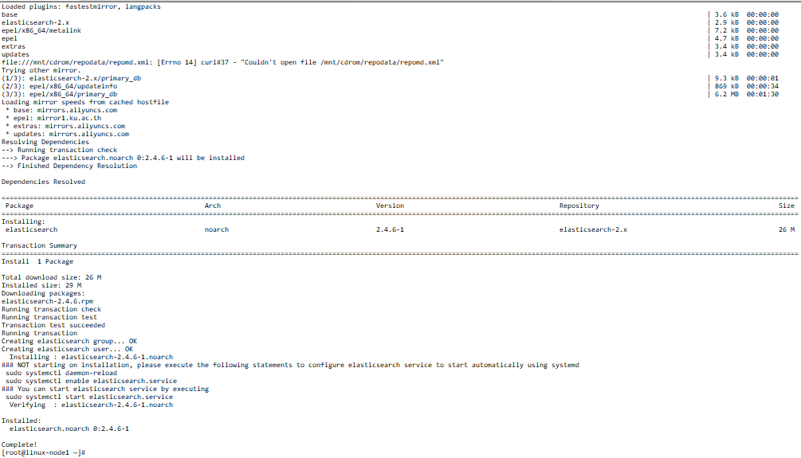
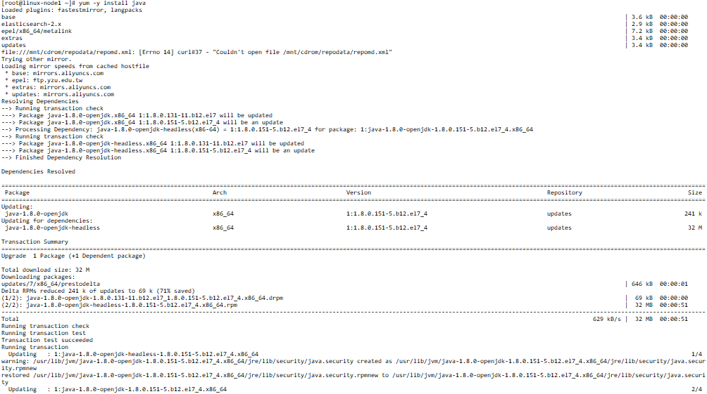

	elasticsearch 安装
	
	下载并安装GPG key
	[root@linux-node1 ~]# rpm --import https://packages.elastic.co/GPG-KEY-elasticsearch

	添加yum仓库
	[root@linux-node1 ~]# vim /etc/yum.repos.d/elasticsearch.repo
	[elasticsearch-2.x]
	name=Elasticsearch repository for 2.x packages
	baseurl=http://packages.elastic.co/elasticsearch/2.x/centos
	gpgcheck=1
	gpgkey=http://packages.elastic.co/GPG-KEY-elasticsearch
	enabled=1

	安装elasticsearch
	[root@linux-node1 ~]# yum install -y elasticsearch

	由于elasticsearch 使用java编写的，所以要安装jdk

	安装完成就可以对elasticsearch进行配置
	[root@linux-node1 ~]# vim /etc/elasticsearch/elasticsearch.yml 
	cluster.name: superman    					# 设置集群的名称
	node.name: linux-node1    					# 设置节点名称
	path.data: /data/es-data  					# 设置数据存放的目录
	path.logs: /var/log/elasticsearch/			# 设置日志存放路径
	bootstrap.memory_lock: true					# 锁住内存，使其不会分配到交换分区上
	network.host: 0.0.0.0
	http.port: 9200

	# 更改完成配置文件所需要做的操作
	[root@linux-node1 ~]# chown elasticsearch:elasticsearch /data/es-data/ -R
	[root@linux-node1 ~]# systemctl start elasticsearch.service
	[root@linux-node1 ~]# systemctl status elasticsearch.service
	● elasticsearch.service - Elasticsearch
	# 接下来打开浏览器输入ip地址加端口号如果能看到以下结果，说明服务启动成功

	   Loaded: loaded (/usr/lib/systemd/system/elasticsearch.service; disabled; vendor preset: disabled)
	   Active: active (running) since Fri 2018-01-12 01:04:58 CST; 4s ago
	     Docs: http://www.elastic.co
	  Process: 4792 ExecStartPre=/usr/share/elasticsearch/bin/elasticsearch-systemd-pre-exec (code=exited, status=0/SUCCESS)
	 Main PID: 4793 (java)
	   CGroup: /system.slice/elasticsearch.service
	           └─4793 /bin/java -Xms256m -Xmx1g -Djava.awt.headless=true -XX:+UseParNewGC -XX:+UseConcMarkSweepGC -XX:CMSInitiatingOccupancyFraction=75 -XX:+UseCMSInitiatingOccupancyOnly -XX:+HeapDumpO...

	Jan 12 01:05:01 linux-node1.example.com elasticsearch[4793]: [2018-01-12 01:05:01,148][WARN ][bootstrap                ] Unable to lock JVM Memory: error=12,reason=Cannot allocate memory
	Jan 12 01:05:01 linux-node1.example.com elasticsearch[4793]: [2018-01-12 01:05:01,151][WARN ][bootstrap                ] This can result in part of the JVM being swapped out.
	Jan 12 01:05:01 linux-node1.example.com elasticsearch[4793]: [2018-01-12 01:05:01,151][WARN ][bootstrap                ] Increase RLIMIT_MEMLOCK, soft limit: 65536, hard limit: 65536
	Jan 12 01:05:01 linux-node1.example.com elasticsearch[4793]: [2018-01-12 01:05:01,151][WARN ][bootstrap                ] These can be adjusted by modifying /etc/security/limits.conf, for example:
	Jan 12 01:05:01 linux-node1.example.com elasticsearch[4793]: # allow user 'elasticsearch' mlockall
	Jan 12 01:05:01 linux-node1.example.com elasticsearch[4793]: elasticsearch soft memlock unlimited
	Jan 12 01:05:01 linux-node1.example.com elasticsearch[4793]: elasticsearch hard memlock unlimited
	Jan 12 01:05:01 linux-node1.example.com elasticsearch[4793]: [2018-01-12 01:05:01,151][WARN ][bootstrap                ] If you are logged in interactively, you will have to re-login for...ake effect.
	Jan 12 01:05:02 linux-node1.example.com elasticsearch[4793]: [2018-01-12 01:05:02,133][INFO ][node                     ] [linux-node1] version[2.4.6], pid[4793], build[5376dca/2017-07-18T12:17:44Z]
	Jan 12 01:05:02 linux-node1.example.com elasticsearch[4793]: [2018-01-12 01:05:02,134][INFO ][node                     ] [linux-node1] initializing ...
	Hint: Some lines were ellipsized, use -l to show in full.

	# 接下来打开浏览器输入ip地址加端口号如果能看到以下结果，说明服务启动成功
	

	logstash安装
	下载并安装GPG key
	[root@linux-node1 ~]# rpm --import https://packages.elastic.co/GPG-KEY-elasticsearch

	添加yum仓库
